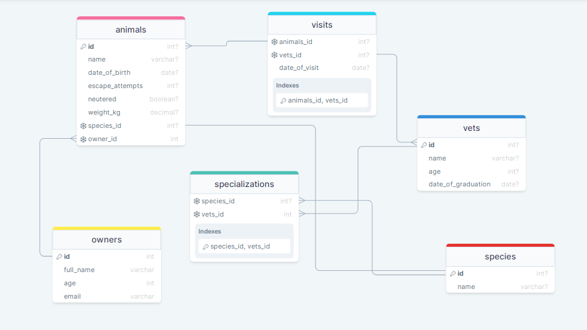

# Vet Clinic database

> This project uses a relational database to create the initial data structure for a vet clinic. This includes a table to store animals' information, insert some data into it, and query it.

## Getting Started

This repository includes files with plain SQL that can be used to recreate a database:

- Use [schema.sql](./schema.sql) to create all tables.
- Use [data.sql](./data.sql) to populate tables with sample data.
- Check [queries.sql](./queries.sql) for examples of queries that can be run on a newly created database. **Important note: this file might include queries that make changes in the database (e.g., remove records). Use them responsibly!**

## Schema diagram

## Built with
- PostgreSQL
- DrawSQL

## Author

👤 **Favour Amarachi Ezeugwa**

- GitHub: [@Favourezeugwa](https://github.com/Favourezeugwa)
- LinkedIn: [Favour Amarachi Ezeugwa](https://www.linkedin.com/in/favour-amarachi-ezeugwa-a5bb31149/)
- Twitter:[@Favour_ezeugwa](https://twitter.com/Favour_ezeugwa)

## 🤝 Contributing

Contributions, issues, and feature requests are welcome!

Feel free to check the [issues page](https://github.com/Favourezeugwa/Vet-clinic-database/issues).

## Show your support

Give a ⭐️ if you like this project!

## Acknowledgments

- Hat tip to Microverse
- Inspiration

## 📝 License

This project is [MIT](./MIT.md) licensed.
